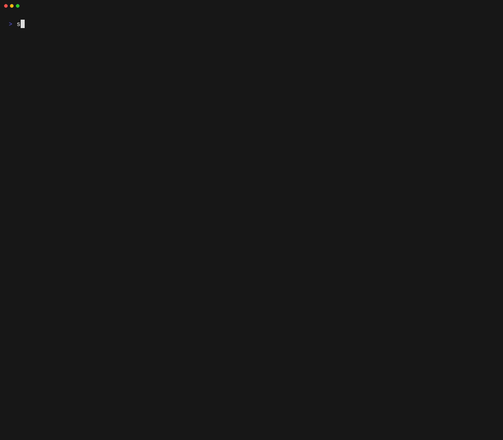

<!-- markdownlint-disable MD033 -->
<p align="center">
  
  <h1 align="center">Specs CLI</h1>
  <p align="center"><strong>Documentation:</strong> <a href="https://cli.specs.dev">cli.specs.dev</a></p>
</p>
<!-- markdownlint-enable MD033 -->

A general-purpose developer CLI for scaffolding projects from templates. Define variables, write template files, run hooks — `specs` handles the rest.



---

## Installation

**Homebrew (macOS):**

```sh
brew install specsnl/tap/specs
```

**Release candidates** — the `@rc` cask tracks every tag, prereleases included:

```sh
brew install specsnl/tap/specs@rc
```

Both casks install a binary called `specs`, so pick one: `brew uninstall specs` before installing
`specs@rc`, and the other way round.

**From source:**

```sh
go install github.com/specsnl/specs-cli@latest
```

**Download a binary** from the [releases page](https://github.com/specsnl/specs-cli/releases).

---

## Quick start

Use a template directly without registering it first:

```sh
specs use specsnl/my-template ./my-project
```

Or register a template and reuse it later:

```sh
specs template download specsnl/my-template my-template
specs template use my-template ./my-project
```

You can also register a local directory as a template:

```sh
specs template save ./my-template my-template
```

### Keeping templates up to date

`specs template list` shows an update `Status` for each registered template:

- **Remote templates** (from `download`) are checked against their git remote.
- **Local templates** (from `save`) are checked against their **source directory on disk** —
  `update available` means the source path has moved ahead of what was saved (`source missing`
  if that path is gone). Uncommitted changes on the saved commit (a "dirty" working tree) are not
  treated as an update, so a dirty source is not reported as perpetually out of date.

`specs template upgrade [name]` applies available updates: remote templates are re-cloned, local
templates are re-copied from their source path. Cached statuses refresh automatically once older
than 24 hours or when written by a different `specs` version.

### Scripting

stdout carries the answer, stderr the narration — so discarding stderr leaves exactly the data,
in either format (`--output` / `-o` selects `pretty` or `json`):

```sh
specs template list -o json 2>/dev/null | jq -r .name
specs version -o json 2>/dev/null          # {"version":"v0.0.13"}
specs template validate ./my-template -o json 2>/dev/null   # {"valid":true}
```

`pretty` and `json` are the only accepted values; anything else exits non-zero naming the flag,
rather than being silently treated as `pretty`.

`json` is NDJSON throughout: **one object per line**, a table row included, so a killed or failed
run still leaves every completed row readable. The keys are snake_case and independent of the
column headings the pretty table prints, and each value keeps its own type — a count is a number,
a timestamp is a timestamp, and a field with no value is absent rather than the `-` the table
shows.

Prompts only happen where something can answer them. With stdin not a terminal — a CI job, or
`< /dev/null` — a template still missing a value fails immediately and names it, instead of
blocking until the runner times out:

```console
$ specs use specsnl/go-service ./out < /dev/null
error cannot prompt for values: stdin is not a terminal
missing values for: project_name
provide them with --arg Key=Value, with --values, or take the schema defaults with --use-defaults
```

Supply every variable and the command runs unattended. `--non-interactive` forces the same
refusal at a terminal, so you can check a command before CI does. A remote template's hook
confirmation is taken as "no" rather than an error: the template applies, the hooks are skipped,
and `--yes` opts in.

Commands that only change the filesystem (`use`, `template save`, `template download`, …) narrate
what they did on stderr and write nothing to stdout.

Pretty tables are capped to the width of your terminal: when a table does not fit, its widest
columns shrink and their cells wrap onto extra lines rather than the table breaking apart. Redirect
stdout to a file or a pipe and the full natural width is written instead; set `COLUMNS` to pin a
width there (`COLUMNS=100 specs template list | less -R`).

The `Repository` column shows a **label**, not the raw value: a GitHub URL reads as
`specsnl/specs-cli` since GitHub is the default host, another host keeps its name
(`gitlab.com/acme/tpl`), and a saved path collapses `$HOME` to `~`. The label is clickable in
terminals that support hyperlinks (iTerm2, WezTerm, kitty, Ghostty, GNOME Terminal, Windows
Terminal, …) and opens the full URL, staying one link even when the column wraps it over several
lines. Terminals without support simply show the label, and a redirect to a file or a pipe writes
plain text.

`--output json` always carries the value as stored, never the label — so scripts read the full URL:

```sh
specs template list -o json 2>/dev/null | jq -r .repository
```

For a template registered with `template save`, that value is the source path, with your home
directory written as `~` (e.g. `~/code/my-template`). Templates saved by versions before this
change carry a `local:` prefix instead; that form is still read, and migrates on the next
`template upgrade`.

---

## The project file

A template's `project.yml` declares its variables, defaults, computed values, and hooks. A few `__`-prefixed keys are reserved by `specs` and never exposed as template variables:

| Key                | Purpose                                                                                                                                                                                                                                                                                                                                                   |
|--------------------|-----------------------------------------------------------------------------------------------------------------------------------------------------------------------------------------------------------------------------------------------------------------------------------------------------------------------------------------------------------|
| `__delimiters`     | Override the default `{{ }}` template delimiters with a custom pair (e.g. `[[ ]]`).                                                                                                                                                                                                                                                                       |
| `__specs__version` | Declare a [semver](https://github.com/Masterminds/semver) constraint on the `specs` CLI version required to use the template, e.g. `__specs__version: ^0.1.0`. `specs use` and `specs template use` refuse to run the template unless the running binary satisfies the constraint (development builds are exempt; `specs template save` skips the check). |

See the [documentation](https://cli.specs.dev) for the full project-file reference.

---

## Development environment

### Overview

The repo ships a `Dockerfile` and a `compose.yml` that together define a self-contained build and test environment. Contributors don't need a local Go installation — all builds and tests run inside a Docker container that pins the exact Go version and tooling.

| File                | Role                                                                                     |
|---------------------|------------------------------------------------------------------------------------------|
| `Dockerfile`        | Defines the build image — Go 1.26 + tooling, used by `task build` and `task test`        |
| `compose.yml`       | Wires the Dockerfile stages into named services consumed by the Taskfile                 |
| `Taskfile.dist.yml` | Orchestrates all developer workflows; wraps Docker Compose so you never call it directly |

**Requirements:** [Task](https://taskfile.dev) and Docker.

### Getting started

Build the images once before running any task:

```sh
task dc:build
```

Then use the standard tasks:

```sh
task build        # Build the binary for the current platform
task test         # Run unit tests
task test:update  # Rewrite the output golden files, then review the diff
```

List all available tasks:

```sh
task --list
```

### How it works

`task dc:build` builds all Docker Compose services in the `build` profile. The key service is `go-builder`, built from the `builder-download` stage of the `Dockerfile`. It mounts the repository root and two Docker volumes — one for the Go module cache and one for the build cache — so subsequent runs are fast.

`task test` and `task build` spin up a one-off `go-builder` container (`docker compose run --rm`), run the Go command inside it, then discard the container. The service doesn't need to be started in advance — it is ephemeral by design.

`task build` also invokes `docker buildx bake` using the `go-binary` service to produce a statically linked binary and copy it out of the image into the project root.

### Without Docker (escape hatch)

If you already have Go 1.26+ installed locally, you can bypass the container entirely:

```sh
go build ./...
go test ./...
```

CI always runs through Docker and the Taskfile. The container is the source of truth for reproducible builds.

### CI and agent execution

All CI and agent workflows follow the same rule: use `task` commands, never call `docker compose` directly. See [`.github/instructions/executing-commands.md`](.github/instructions/executing-commands.md) for the authoritative execution rules.

---

## License

MIT — see [LICENSE](./LICENSE).
