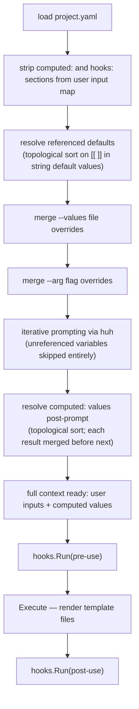

# Computed Values

## Problem

There is no way to define a value that is:
- Always derived from other inputs (never prompted)
- Available in template files under a clean name
- Composed of hardcoded strings, Sprout functions, and references to user-provided inputs

The **referenced default** feature addresses a different need: a user input that has a computed
pre-fill but the user can still override it. Computed values are never shown to the user — they
are purely derived.

---

## Decision

Add a top-level `computed:` section to `project.yaml`. Keys in `computed:` are:
- Evaluated **after** all user inputs are finalised (post-prompt)
- **Never** shown as prompts
- **Not** overridable via `--values` or `--arg`
- Merged into the context and available in template files and hook commands

---

## Syntax

```yaml
# User inputs (prompted)
ProjectName: My Acme Project
ProjectShortName: acme-12
UseSonarQube: false

# Referenced default — prompted with computed pre-fill, user can override
ProjectSlug: "[[ .ProjectShortName | toKebabCase ]]"

# Computed — never prompted, always derived
computed:
  ProjectEnvName: "[[ .ProjectShortName | toSnakeCase | toUpperCase ]]"
  Year:           "[[ now | date \"2006\" ]]"
  DbName:         "[[ .ProjectSlug ]]_production"
  DbTestName:     "[[ .DbName | replace \"_production\" \"_test\" ]]"

hooks:
  post-use:
    - composer install
```

Rules:
- Values are Go template expressions using `[[ ]]` delimiters and the full Sprout FuncMap.
- A computed key **must not** duplicate a user input key — error at load time.
- A computed key **cannot** be overridden by `--values` or `--arg`.
- Computed values **can** reference other computed values (topological sort).

---

## Difference from Referenced Defaults

| | Referenced default | Computed value |
|---|---|---|
| Defined as | String with `[[` in the user input section | Key under `computed:` |
| User prompted? | Yes — shown with computed result as pre-fill | **No** |
| User can override? | Yes | **No** |
| Resolved when? | Before prompting (pre-fill calculation) | After all inputs are finalised |
| Can reference other computed values? | No | Yes (topological sort) |

---

## Resolution Order



Step G is important: a computed value that references another computed value sees the
already-resolved result, not the raw template string.

---

## Dependency Resolution

Computed values may reference each other. A topological sort is applied:

1. Parse each computed value template and extract `.Key` references.
2. Build a dependency graph among computed keys (user-input keys are leaves).
3. Apply Kahn's algorithm.
4. Error if a cycle is detected — names the keys involved.

**Valid dependency chain:**

```yaml
computed:
  ProjectSlug: "[[ .ProjectShortName | toKebabCase ]]"       # depends on user input
  DbName:      "[[ .ProjectSlug ]]_production"              # depends on ProjectSlug
  DbTestName:  "[[ .DbName | replace \"_production\" \"_test\" ]]"  # depends on DbName
```

Resolution order: `ProjectSlug` → `DbName` → `DbTestName`.

**Cycle (error):**

```yaml
computed:
  A: "[[ .B ]] suffix"
  B: "prefix [[ .A ]]"
  # A depends on B, B depends on A → cycle error
```

---

## Error Handling

| Situation | Behaviour |
|---|---|
| Computed key duplicates a user input key | Error at load time |
| `--values` or `--arg` targets a computed key | Error before prompting |
| Template syntax error in a computed value | Fatal error — names the key |
| Reference to non-existent key | Fatal error — names the computed key |
| Cycle between computed values | Fatal error — lists the keys involved |

---

## Template Availability

Computed values are available in template files and hook commands exactly like user inputs:

```
# Template file content
DB_DATABASE=[[ .DbName ]]
DB_TEST_DATABASE=[[ .DbTestName ]]
APP_ENV_PREFIX=[[ .ProjectEnvName ]]
```

In hooks, computed values are available as `SPECS_`-prefixed uppercase env vars, the same
as user inputs.
