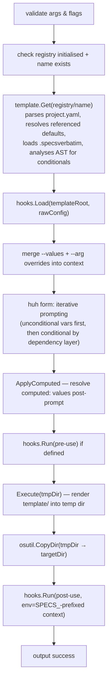
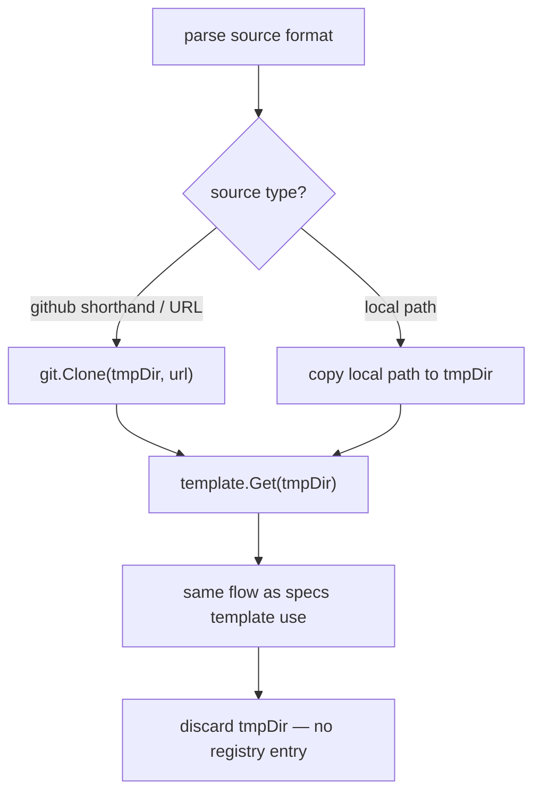
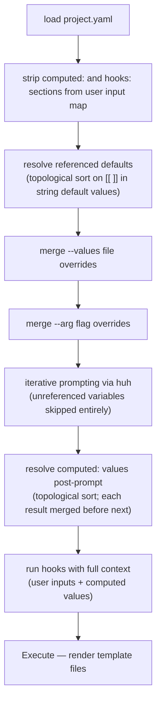

# Specs CLI — Architecture

## Goals

- Fix all known correctness bugs from the original boilr v1
- Replace the prompt layer with huh (Charm)
- Replace output styling with lipgloss
- Switch template delimiters to `[[ ]]`
- Replace `project.json` with `project.yaml`
- Add hooks, `--values`/`--arg`, XDG config, `.specsverbatim`, conditional files
- Add computed values (post-prompt derived context keys)
- Add `specs use` one-step command
- Maintain backward compatibility with v1 templates

---

## Package Structure

```
specs-cli/
├── main.go                       # main() — XDG init, cmd.Execute()
├── go.mod
└── pkg/
    ├── specs/                    # global config & constants
    │   ├── configuration.go      # XDG paths, file name constants
    │   └── errors.go             # sentinel errors
    ├── cmd/                      # one file per Cobra command
    │   ├── root.go
    │   ├── app.go                # App struct, --debug/--safe-mode flags
    │   ├── use.go                # specs use <source> <target-dir>
    │   ├── template.go           # specs template subcommand group
    │   ├── template_download.go
    │   ├── template_save.go
    │   ├── template_use.go       # --values, --arg, --no-hooks
    │   ├── template_list.go
    │   ├── template_validate.go
    │   ├── template_rename.go
    │   ├── template_delete.go
    │   ├── template_update.go
    │   ├── template_upgrade.go
    │   ├── metadata.go           # writeMetadata() helper
    │   └── version.go
    ├── template/                 # template loading & execution engine
    │   ├── template.go           # Get(), Execute(), [[ ]] delimiters
    │   ├── context.go            # project.yaml parsing, referenced defaults, computed values
    │   ├── verbatim.go           # .specsverbatim loading & matching
    │   ├── functions.go          # FuncMap (custom + Sprout)
    │   ├── specsregistry.go      # custom Sprout registry (hostname, password, etc.)
    │   ├── analysis.go           # AST-based conditional variable analysis
    │   ├── cond.go               # Cond interface and implementations
    │   ├── metadata.go           # Metadata struct, JSONTime
    │   ├── status.go             # TemplateStatus — remote stale-check caching
    │   └── validate.go           # template validation helpers
    ├── hooks/                    # hook execution
    │   └── hooks.go              # Load(), Run(), context → env vars
    ├── host/                     # source URL parsing
    │   └── source.go             # github:user/repo, HTTPS URL, local path
    └── util/
        ├── exit/                 # exit codes
        ├── git/                  # go-git wrapper, SSH auth, remote check
        ├── osutil/               # file operations (CopyDir, etc.)
        ├── output/               # lipgloss-based logger + table renderer
        ├── validate/             # Name() validator and argument validators
        └── values/               # --values file (JSON/YAML) + --arg flag parsing
```

---

## CLI Command Tree

```
specs [--version|-v]
      [--debug]                             enable debug output
      [--safe-mode]                         disable env/filesystem template functions + hooks
      [--no-env-prefix]                     disable SPECS_ prefix on hook env vars
      [--output/-o pretty|json]             output format (default: pretty)
│
├── use <source> <target-dir>               one-step, no registry entry
│     [--values file.yaml|json]
│     [--arg Key=Value]...
│     [--use-defaults]
│     [--no-hooks]
│
├── template
│   ├── download [--force] <source> <name>
│   ├── save     [--force] <path> <name>
│   ├── use      <name> <target-dir>
│   │     [--values file.yaml|json]
│   │     [--arg Key=Value]...
│   │     [--use-defaults]
│   │     [--no-hooks]
│   ├── list|ls
│   ├── update   [name]                     refresh status cache (all if no name)
│   ├── upgrade  [name]                     re-clone to latest (all if no name)
│   ├── delete|remove|rm|del <name>...
│   ├── validate <path>
│   └── rename|mv <old> <new>
│
├── init    [--force]
└── version [--dont-prettify]
```

### `specs use <source> <target-dir>`

One-step command — downloads, executes, discards. No registry entry created.

| Format | Example |
|--------|---------|
| GitHub shorthand | `github:Ilyes512/boilr-laravel-project` |
| GitHub with branch | `github:Ilyes512/boilr-laravel-project:main` |
| Full HTTPS URL | `https://github.com/Ilyes512/boilr-laravel-project` |
| SCP-style SSH | `git@github.com:Ilyes512/boilr-laravel-project` |
| SSH URL | `ssh://git@github.com/Ilyes512/boilr-laravel-project` |
| Local path (explicit) | `file:./my-template` |
| Local path (implicit) | `./my-template` or `/absolute/path` |

SSH clones are authenticated automatically via SSH agent or standard key files
(`~/.ssh/id_ed25519`, `id_rsa`, `id_ecdsa`). Host key verification uses `~/.ssh/known_hosts`.

---

## Template Structure

```
<template-root>/
├── project.yaml              # variable schema, defaults, optional inline hooks
├── .specsverbatim            # verbatim-copy glob patterns (opt-out from rendering)
├── __metadata.json           # written by specs on download/save
├── __status.json             # remote status cache (written by specs template list)
├── hooks/                    # script-based hooks (mutually exclusive with hooks: in project.yaml)
│   ├── pre-use.sh
│   └── post-use.sh
└── template/
    ├── [[ if .UseSonarQube ]]sonar-project.properties[[ end ]]
    ├── composer.json
    ├── composer.lock         # matched by .specsverbatim → verbatim copy
    └── .github/
        └── workflows/
            └── ci.yml        # ${{ }} passes through untouched with [[ ]] delimiters
```

---

## Configuration

```
$XDG_CONFIG_HOME/specs/          (default: ~/.config/specs/)
└── templates/
    └── <name>/
        ├── project.yaml
        ├── .specsverbatim
        ├── __metadata.json
        ├── __status.json
        ├── hooks/
        └── template/
```

---

## Data Flow — `specs template use`



---

## Data Flow — `specs use <source> <target>`



---

## Template Execute — File Walk

```mermaid
flowchart TD
    A["filepath.WalkDir(template/)"] --> B{ignoredFile?}
    B -->|yes| Skip1[skip]
    B -->|no| C[render path as template with \[\[ \]\] engine]
    C --> D{render error or result empty?}
    D -->|yes| Skip2[skip]
    D -->|no| E{any path segment empty?}
    E -->|yes| Skip3[skip dir tree]
    E -->|no| F{is directory?}
    F -->|yes| Mkdir[os.MkdirAll]
    F -->|no| G{matches .specsverbatim?}
    G -->|yes| Copy1[copy verbatim]
    G -->|no| H{isBinary?}
    H -->|yes| Copy2[copy verbatim]
    H -->|no| I[render content with \[\[ \]\] engine]
    I --> J{whitespace-only result?}
    J -->|yes| Skip4[skip — do not create file]
    J -->|no| Write[write to dest]
```

---

## Context Resolution



---

## Output System (`pkg/util/output`)

All user-facing output goes through the `output.Writer` interface:

```go
type Writer interface {
    Info(format string, args ...any)
    Warn(format string, args ...any)
    Error(format string, args ...any)
    Table(headers []string, rows [][]string)
}
```

Two implementations are selected at startup via `--output`:

| Flag value | Writer | Behaviour |
|---|---|---|
| `pretty` (default) | `HumanWriter` | Lipgloss-styled text; `Info` → stdout, `Warn`/`Error` → stderr |
| `json` | `JSONWriter` | NDJSON lines (`{"level":"info","message":"…"}`); `Table` → JSON array to stdout |

The `JSONWriter` is useful for scripting (`specs template list --output json`) or CI pipelines
that parse structured output.

---

## Hooks Execution

```go
// pkg/hooks/hooks.go

type Hooks struct {
    PreUse    []string // each entry: single command or multiline bash script
    PostUse   []string
    EnvPrefix string   // prefix prepended to each context key in the env (e.g. "SPECS_")
}

// Load reads hook definitions from templateRoot.
// Sources (mutually exclusive — error if both are present):
//   - Inline: the "hooks" key in projectConfig (parsed from project.yaml)
//   - Directory: hooks/pre-use.sh and hooks/post-use.sh under templateRoot
func Load(templateRoot string, projectConfig map[string]any, envPrefix string) (*Hooks, error)

// Run executes each command via bash -c.
// ctx is injected as SPECS_-prefixed uppercase env vars: ProjectName → SPECS_PROJECTNAME.
// [[ ]] expressions in hook commands are rendered against ctx before execution.
// Stops and returns error on first non-zero exit.
func (h *Hooks) Run(trigger, cwd string, ctx map[string]any, funcMap template.FuncMap) error
```

---

## Packages Added / Changed vs boilr v1

| Package | Status | Change |
|---------|--------|--------|
| `pkg/specs` | **new** | XDG paths, file name constants (replaces `pkg/boilr`) |
| `pkg/cmd` | updated | new `use.go`, `template_update.go`, `template_upgrade.go`, iterative conditional prompting |
| `pkg/template` | updated | `[[ ]]` delimiters, `context.go`, `verbatim.go`, conditional skip, AST analysis, status |
| `pkg/hooks` | **new** | hook loading and execution |
| `pkg/util/output` | **new** | lipgloss-based logger + table renderer (replaces tlog + tabular) |
| `pkg/util/values` | **new** | `--values` file (JSON/YAML) and `--arg` flag parsing |
| `pkg/host` | updated | source format parsing (github:, HTTPS, SSH, local path) |
| `pkg/prompt` | **removed** | replaced by `huh` |
| `pkg/util/tlog` | **removed** | replaced by `pkg/util/output` |
| `pkg/util/tabular` | **removed** | replaced by `pkg/util/output` |
| `pkg/util/exec` | **removed** | no longer needed (hooks use `os/exec` directly) |
| `pkg/util/exit` | unchanged | |
| `pkg/util/git` | updated | SSH auth, `CheckRemote()`, `Describe()` for status tracking |
| `pkg/util/osutil` | updated | `CopyDir()` recursive copy |
| `pkg/util/validate` | updated | `Name()` validator (alphanumeric + hyphens + underscores) |
