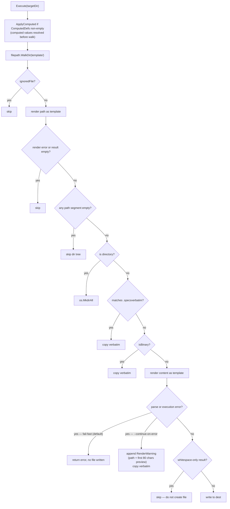

## Template Directory Convention

Every specs template is a directory with this structure:

```text
<template-root>/
├── project.yml          # variable schema with defaults
├── .specsverbatim        # verbatim-copy glob patterns (opt-out from rendering)
├── __metadata.json       # written by specs (name, repo, created)
└── template/             # the files that get rendered
    ├── {{ .Name }}.go    # {{ }} template syntax in filenames
    ├── README.md         # {{ }} template syntax in file contents
    └── src/
        └── {{ .Package }}/
            └── main.go
```

Only the `template/` subdirectory is ever rendered and written to the target.

---

## `project.yml` — Context Schema

Defines the variables that specs collects from the user (or uses as defaults).

```yaml
ProjectName: My Acme Project
ProjectShortName: acme-12

# Select — first value is the default
PhpVersion:
  - "8.5"
  - "8.4"
  - "8.3"

# Bool — false = no, true = yes
UseSonarQube: false

# Referenced default — shown as pre-fill, user can override
ProjectSlug: "{{ .ProjectShortName | toKebabCase }}"

# Computed — never prompted, always derived from final inputs
computed:
  DbName: "{{ .ProjectShortName | toSnakeCase }}_production"
  Year:   "{{ now | date \"2006\" }}"
```

| Value type               | Prompt behaviour                                             |
|--------------------------|--------------------------------------------------------------|
| `string`                 | Free-text input with default shown                           |
| `bool`                   | Yes/No confirm prompt                                        |
| `[]string`               | Select list; first item is default                           |
| `string` containing `{{` | Referenced default — pre-fill computed, user can override    |
| `computed:` section      | Never prompted — derived after all user inputs are finalised |

---

## Configurable Delimiters

Specs uses `{{ }}` by default — standard Go `text/template` syntax. To avoid conflicts with tools that also use `{{ }}` (e.g. GitHub Actions, Helm), you can override the delimiters per template using the reserved `__delimiters` key in `project.yml`:

```yaml
__delimiters:
  left: "[["
  right: "]]"
```

Both `left` and `right` must be non-empty strings. The `__delimiters` key is reserved: it is never treated as a user variable (never prompted for, never flagged as unused), but its value is available to templates for reading as `{{ .__delimiters }}` — see below.

### Reserved `__` namespace

The entire `__` prefix is reserved for specs configuration keys (such as `__delimiters`), so
that future configuration can be added without clashing with existing template variables.
A template may **not** define a user variable or a computed value whose name starts with `__`
unless it is a recognised configuration key. Any other `__`-prefixed name is rejected with
`ErrReservedVariableName` (`error_kind: reserved_variable_name`).

The check runs whenever a project file is loaded — during `template download`, `template use`
(and `specs use`), and `template validate` — so a template that misuses the namespace is
rejected at download time rather than only failing later at execution. Runtime overrides are
held to the same rule: a reserved name supplied via `--arg __foo=…` or a `--values` file is
also rejected.

```yaml
Name: my-project
__future: nope   # error: variable names starting with "__" are reserved
computed:
  __derived: "{{ .Name }}"   # error: computed names are reserved too
```

Reserved keys are held out of the schema context (`Template.Context`) so they are never prompted
for or reported as unused. Their raw values are captured separately in `Template.Reserved` and
merged into the render context in `Execute`, so templates can read them under their original key —
e.g. `{{ .__specs__version }}` or `{{ .__delimiters.left }}`. `Validate` also treats these keys
as defined, so referencing one is never flagged as an unknown variable.

With `[[ ]]` delimiters configured, `{{ }}` in your files passes through unchanged:

```yaml
# With __delimiters: left: "[[", right: "]]"

# ${{ }} passes through unchanged — no escaping needed
group: ${{ github.workflow }}-${{ github.ref }}
SONAR_TOKEN: ${{ secrets.SONAR_TOKEN }}

# Template expressions use [[ ]]
MARIADB_DATABASE: "[[ .ProjectShortName | toSnakeCase ]]_test"
```

---

## Version Gate (`__specs__version`)

Before loading a template's context, `template.Get()` runs a pre-flight check against the
reserved `__specs__version` key in `project.yml`. It lets a template author declare which
`specs` CLI versions the template supports:

```yaml
__specs__version: ^0.1.0
```

The value is any valid [Masterminds/semver](https://github.com/Masterminds/semver) constraint
string (`0.1.0`, `^0.1.0`, `~0.1.0`, `>= 0.1.0, < 2.0`, …), so both lower and upper bounds can
be expressed. `template.ExtractSpecsVersion` parses it with `semver.NewConstraint`; the private
`checkSpecsVersion` helper then evaluates it against the running CLI version (injected via
`Config.Version` from the cmd layer, so `pkg/template` never imports `pkg/cmd`):

| Condition                                                  | Outcome                                                               |
|------------------------------------------------------------|-----------------------------------------------------------------------|
| Key absent                                                 | No check — proceed                                                    |
| Present but not a string, or not a parseable constraint    | `ErrInvalidSpecsVersion` — refuse to load                             |
| `Config.Version` is empty, `dev`, or otherwise unparseable | Check skipped with a `slog.Debug` line — never lock out source builds |
| Parsed CLI version does not satisfy the constraint         | `ErrSpecsVersionUnsatisfied` (wrapped with `%w`)                      |
| Parsed CLI version satisfies the constraint                | Proceed                                                               |

The gate fires for both `specs use` and `specs template use` (which share `executeTemplate`).
`specs template save` never calls `Get()`, so a newer template can still be saved on an older
CLI. The reserved key is consumed during load and never exposed as a template variable.

---

## Always-ignored files

The following files are silently skipped during rendering, regardless of any other
configuration. They are OS/editor metadata that should never appear in scaffolded output:

| Filename    | Origin           |
|-------------|------------------|
| `.DS_Store` | macOS Finder     |
| `Thumbs.db` | Windows Explorer |

These files are skipped at the walk stage — they are never copied, rendered, or passed to
`.specsverbatim`. This list is fixed; use `.specsignore` if per-template suppression is
ever added in the future.

---

## `.specsverbatim` — Verbatim Copy

A `.specsverbatim` file at the template root lists glob patterns for files that should be
copied byte-for-byte without any template rendering:

```text
# .specsverbatim
composer.lock
package-lock.json
*.min.js
vendor/**
```

---

## Conditional Files and Directories

Use the filename itself as a template expression. After rendering:

- Empty or whitespace result → skip the file/directory
- Any **path segment** empty → skip the file (enables conditional directory trees)

```text
template/
└── {{ if .UseSonarQube }}sonar-project.properties{{ end }}
└── {{ if .UseSonarQube }}docs/images{{ end }}/
    └── badge.png
```

| `UseSonarQube`      | Rendered path              | Result                  |
|---------------------|----------------------------|-------------------------|
| `true`              | `sonar-project.properties` | created                 |
| `false`             | *(empty)*                  | skipped                 |
| `false` (badge.png) | `/badge.png`               | skipped — empty segment |

---

## Render Pipeline



### Render error modes

| Mode                    | Behaviour                                                                                                                                                                                | How to enable              |
|-------------------------|------------------------------------------------------------------------------------------------------------------------------------------------------------------------------------------|----------------------------|
| **Fail-fast** (default) | Parse or execution errors abort `Execute` immediately; no destination file is written for the affected path. The tmp dir is cleaned up by the deferred `os.RemoveAll` in `template use`. | Default — no flag needed   |
| **Continue-on-error**   | Parse or execution errors are recorded as `RenderWarning` entries and the file is copied verbatim. Restores the pre-v0.x behaviour. Use only when `.specsverbatim` is not an option.     | `--continue-on-error` flag |

If any `RenderWarning` entries are present after `Execute` returns (only possible with `--continue-on-error`):

- **`template use`** reports each affected file via `Output.Warn`, including the destination
  path and the first 80 characters of the unrendered source so the user can grep for
  straggling `{{ }}` literals. It also suggests running `specs template validate <name>`.
- **`template validate`** reports each affected file, includes them in the exit code
  (`ValidateRender = 4`), and always runs at debug log level so no diagnostic output
  is suppressed.

### Binary Detection

The engine inspects the first 512 bytes of every file using a two-stage check. Binary files
are copied byte-for-byte; no template rendering is attempted.

**Detection order:**

1. **`http.DetectContentType`** — identifies known binary formats by magic bytes (JPEG, PNG,
   PDF, ZIP, gzip, and others). If the detected content type is not a `text/*` type, the
   file is treated as binary.
2. **Null-byte / invalid-UTF-8 fallback** — if `DetectContentType` returns `text/plain`,
   the file is still treated as binary when the first 512 bytes contain a null byte or are
   not valid UTF-8. This catches edge cases such as UTF-16 LE files (which have many null
   bytes) or binary payloads whose prefix happens to look like text.

**Limitations and `.specsverbatim`:**
Binary detection is best-effort. Any file that must be copied verbatim should be listed
explicitly in `.specsverbatim` rather than relying on auto-detection:

```text
# .specsverbatim — recommended patterns for common binary assets
*.png
*.jpg
*.ico
*.woff
*.woff2
*.ttf
*.pdf
*.gz
*.tar
*.zip
```

### File Permissions

Source file permission bits (mode) are always preserved in the destination, regardless of
the copy strategy:

- **Binary / verbatim copy** (`copyFile`): the source `os.Stat` mode is applied to the
  destination via `os.OpenFile(..., info.Mode())` followed by `os.Chmod`.
- **Rendered text** (`writeFile`): `renderFile` stats the source before rendering and
  passes `info.Mode()` to `writeFile`, which applies it with `os.WriteFile` + `os.Chmod`.

The same preservation applies when a template is saved to the local registry
(`specs template save` / `specs use <local-path>`): `osutil.CopyDir` uses the same
`os.Stat` + `os.Chmod` pattern, so a script that is `chmod +x` in the source stays
executable in the registry and in every scaffolded output.

---

## Template Functions

All of Go's standard `text/template` built-ins are available, plus:

### Custom Functions (`internal/template/specsregistry.go`)

| Function         | Signature                                                         | Description                             |
|------------------|-------------------------------------------------------------------|-----------------------------------------|
| `hostname`       | `() string`                                                       | System hostname                         |
| `username`       | `() string`                                                       | Current OS username (env/UID fallbacks) |
| `toBinary`       | `(n int) string`                                                  | Format integer as binary string         |
| `formatFilesize` | `(bytes float64) string`                                          | Human-readable size (KB/MB/GB…)         |
| `password`       | `(length, digits, symbols int, noUpper, allowRepeat bool) string` | Secure random password                  |

### Sprout Functions

All functions from [`go-sprout/sprout`](https://github.com/go-sprout/sprout) are available —
~100 helpers for string manipulation, math, date/time, encoding, and more.

Key renamed functions vs the old sprig library:

| Old (sprig)         | New (sprout)                    |
|---------------------|---------------------------------|
| `kebabcase`         | `toKebabCase`                   |
| `snakecase`         | `toSnakeCase`                   |
| `camelcase`         | `toPascalCase`                  |
| `upper`             | `toUpper`                       |
| `lower`             | `toLower`                       |
| `title`             | `toTitleCase`                   |
| `b64enc` / `b64dec` | `base64Encode` / `base64Decode` |

### Template Options

```go
tmpl.Option("missingkey=error")
```

Any variable referenced in a template that has no value in the context causes an error,
preventing silent empty substitutions.

### Safe Mode

When `--safe-mode` is set (or for untrusted template sources), the `env` and `filesystem`
Sprout registries are disabled — templates cannot read host environment variables or access
the filesystem beyond their own template directory.

---

## Iterative Conditional Prompting

Before prompting, specs analyses the template file tree's AST to determine which variables
are guarded behind conditions (see `internal/template/analysis.go`). Prompting is iterative:

1. **Pass 1** — unconditional variables (always needed, regardless of any condition)
2. **Pass 2+** — each round finds conditional variables whose guard variables are all resolved,
   evaluates the condition against the current context, and prompts those that are needed.
   This repeats until no more conditional variables can be resolved.

Variables that appear nowhere in the template files or computed expressions are skipped
entirely — they are never prompted regardless of their presence in `project.yml`.

The condition types recognised by the AST analyser are:

| Template expression        | Condition type             |
|----------------------------|----------------------------|
| `{{ if .Var }}`            | `condField` — truthy check |
| `{{ if not .Var }}`        | `condNot` — negation       |
| `{{ if eq .Var "value" }}` | `condEq` — equality        |
| `{{ if ne .Var "value" }}` | `condNe` — inequality      |
| `{{ if and .A .B }}`       | `condAnd` — conjunction    |
| `{{ if or .A .B }}`        | `condOr` — disjunction     |

Unrecognised condition forms fall back to treating the variable as always-needed
(conservative: over-prompt rather than under-prompt).

---

## Hooks

Hooks run shell commands before and after `specs template use`. Two trigger points:

| Hook       | Working directory         | Runs                                                                                  |
|------------|---------------------------|---------------------------------------------------------------------------------------|
| `pre-use`  | template source directory | Before any files are rendered. Non-zero exit aborts.                                  |
| `post-use` | target (output) directory | After all files are written. Receives resolved context as `SPECS_`-prefixed env vars. |

Two mutually exclusive definition forms:

**Form A — inline in `project.yml`:**

```yaml
hooks:
  pre-use:
    - echo "Scaffolding {{ .ProjectName }}..."
  post-use:
    - composer install
    - npm install
    - |
      git init
      git add -A
      git commit -m "Initial commit: {{ .ProjectName }}"
```

**Form B — script files:**

```text
template-root/
├── project.yml
├── hooks/
│   ├── pre-use.sh
│   └── post-use.sh
└── template/
```

Context values are injected as `SPECS_`-prefixed uppercase env vars:
`ProjectName` → `SPECS_PROJECTNAME`.
The prefix can be disabled with the root `--no-env-prefix` flag.

### Trust model

Hooks run arbitrary shell commands on the host. Before running any template with hooks:

| Scenario                            | Behaviour                                                                             |
|-------------------------------------|---------------------------------------------------------------------------------------|
| `--safe-mode` (no `--allow-hooks`)  | Hooks are **skipped entirely** — no bash invocation                                   |
| `--safe-mode --allow-hooks`         | Function-level restrictions apply; hooks **run** (remote confirmation still required) |
| `specs use <remote>` with hooks     | Rendered hook commands are **printed** and **interactive confirmation** is required   |
| `specs use <remote> --yes`          | Confirmation prompt is skipped; hooks run (CI use)                                    |
| `specs use <remote> --no-hooks`     | Hooks are **skipped**                                                                 |
| Local template or registry template | No confirmation prompt; hooks run as normal                                           |

**`--safe-mode` implies `--no-hooks`** in the command layer. Pass `--allow-hooks` alongside `--safe-mode` to disable only the env/filesystem template functions while still allowing hooks to execute.

When running a remote template interactively (`specs use github:user/repo ./out`), specs prints all pre-use and post-use hook commands (rendered against the resolved context) and asks for confirmation before executing any of them. Passing `--yes` suppresses this prompt for scripted or CI use.

If `bash` is not on `PATH`, hook execution returns an actionable error identifying the missing shell rather than a confusing process-not-found failure.

---

## Metadata (`template.Metadata`)

```go
type Metadata struct {
    Name       string   `json:"Name"`
    Repository string   `json:"Repository"`
    Branch     string   `json:"Branch,omitempty"`
    Created    JSONTime `json:"Created"`            // set on first install; preserved across upgrades
    Updated    JSONTime `json:"Updated"`            // set on first install; refreshed on each upgrade
    Commit     string   `json:"Commit,omitempty"`   // full SHA-1 of HEAD at download/upgrade
    Version    string   `json:"Version,omitempty"`  // git-describe-style version string
}
```

`Created` records when the template was first added to the registry (via
`template download` or `template save`) and is intentionally preserved across
`template upgrade` so the `list` command's `Created` column reflects the
original install time, not the most recent upgrade.

`Updated` records the last time the template was upgraded (via `template
upgrade`). On first install it is set to the same timestamp as `Created`, and it
is refreshed to the current time on each successful upgrade. The `list` command's
`Updated` column reflects this value. Metadata written before the `Updated` field
existed has no `Updated` key; `LoadMetadata` falls back to `Created` in that case
so pre-existing templates still display a sensible value.

`Commit` and `Version` change on upgrade (alongside `Updated`); `Created` never
does.

`JSONTime` wraps `time.Time` with RFC1123Z serialisation and a human-readable `"X time ago"`
display format for the `list` command.

---

## Validation (`specs template validate`)

`specs template validate` always runs at debug log level so no diagnostic output is suppressed.
It calls `Execute` on a temporary directory first to catch render errors, then calls
`Template.Validate()` for static analysis.

Three categories of issues are reported:

| Issue kind         | Source       | Meaning                                                                          |
|--------------------|--------------|----------------------------------------------------------------------------------|
| `render_error`     | `Execute()`  | A file could not be rendered (parse or execution error) and was copied verbatim. |
| `unknown_variable` | `Validate()` | A name used in a template file or path is **not defined** in `project.yaml`.     |
| `unused_variable`  | `Validate()` | A variable **defined** in the user input section is never referenced anywhere.   |
| `unused_computed`  | `Validate()` | A computed value **defined** under `computed:` is never referenced anywhere.     |

Exit codes are a bitmask — multiple conditions combine additively:

| Bit | Constant          | Value | Condition                                                                 |
|-----|-------------------|-------|---------------------------------------------------------------------------|
| 2   | `ValidateRender`  | 4     | Any `render_error` — file copied verbatim due to parse or execution error |
| 1   | `ValidateUnknown` | 2     | Any `unknown_variable`                                                    |
| 0   | `ValidateUnused`  | 1     | Any `unused_*` (only with `--strict`)                                     |

`specs template validate` exits 0 only when there are no render errors and no unknown variables.

---

## Template Status Tracking

`__status.json` caches the result of a status check per template. The `list` command
refreshes entries that need it concurrently, bounded to at most 8 parallel checks via
`errgroup.SetLimit(8)`. Each individual remote check has a 10-second per-remote timeout;
the entire refresh phase has a 30-second top-level timeout. Both timeouts use `context.Context`
propagated from the command, so Ctrl-C cancels in-flight checks immediately.
The `update` command forces an immediate refresh for one or all templates.

```go
type TemplateStatus struct {
    CheckedAt     JSONTime              // time of last check
    IsUpToDate    bool                  // true when no newer version is available (see below)
    LatestVersion string                // set when a newer version is available
    ErrorKind     pkggit.CheckErrorKind // "network", "auth", "not-found", "source-missing", "unknown", or ""
    SpecsVersion  string                // specs CLI version that wrote this status
}
```

`specs template list` displays a `Status` column with labels: `up-to-date`,
`update: <version>`, `update available`, `unknown (offline?)`, `auth error`, `not found`,
`source missing`.

### When a cached status is refreshed

`TemplateStatus.NeedsRefresh(currentVersion)` decides whether the `list` command re-checks a
cached status. A refresh happens when either:

- the status is **stale** — older than 24 hours (`IsStale`); or
- the status was written by a **different specs version** — `SpecsVersion` does not match the
  running binary.

The version guard ensures a status produced by an older binary with different check logic is
never trusted after an upgrade: a status-detection fix takes effect on the first `list` after
the upgrade instead of waiting out the 24-hour window. `SpecsVersion` is stamped on every
status written by `list` and `update`.

### Remote vs local templates

The source of truth depends on how the template was registered:

- **Remote templates** (`Repository` is a git URL) are checked against the remote via
  `CheckRemoteContext`, which lists the remote refs without modifying the local checkout.
- **Local templates** (`Repository` is `local:<path>`, from `specs template save`) are checked
  against the **source directory on disk** via `CheckLocalSource` — never a git remote. The
  template is behind when the source path's current `git describe` (commit + version) differs
  from the commit/version recorded in metadata at save time. The trailing `-dirty` marker is
  ignored while the source stays on the saved commit: an uncommitted (dirty) working tree flips
  that suffix on the git-describe version even though `HEAD` has not moved, so comparing it
  verbatim would report a phantom update to the same commit (issue #97). When the source path no
  longer exists (or is no longer a git repository) the status is `source-missing`. A local
  template saved from a non-git directory has no recorded commit and is not tracked.

### How a newer version is determined (remote templates)

`resolveStatus` compares the remote refs against the local checkout using two modes:

- **Tag-tracked** — the tracked ref is itself a semver tag (e.g. the template was downloaded
  with `github:owner/repo:1.1.0`). A newer version is the **highest semver tag strictly
  greater** than the current one. A lower-numbered tag published later (e.g. `1.0.1` after
  `1.1.0`) is never treated as an update.
- **Branch-tracked** — the tracked ref is a branch (the default when no ref is given). If the
  local checkout sits exactly on a released semver tag, the same semver rule as above applies:
  an update requires a strictly-greater semver tag, so `1.0.1` pushed on a commit newer than
  the installed `1.1.0` is **not** reported as an update. When the checkout is not on a semver
  tag (a rolling branch), the check falls back to comparing the branch-tip commit against the
  local `HEAD`, so any new commit counts as an update.

This ensures "newer" always follows semantic-versioning rules for tagged templates, regardless
of the order in which tags were pushed (issue #83). Determining whether the checkout is on a
released version uses the tag that points exactly at `HEAD` (dereferencing annotated tags)
rather than parsing git-describe output, whose `-<n>-g<hash>` suffix would otherwise be
misread as a semver pre-release.
